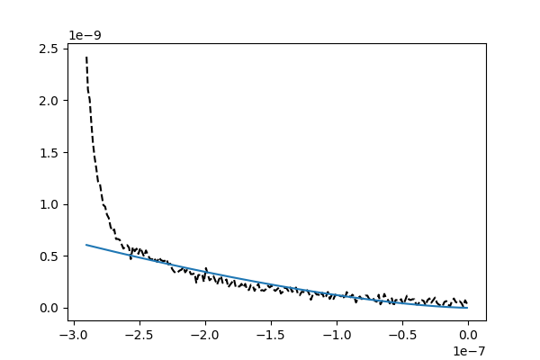

# Atomic-Force-Microscopy
Automation in predicting the Youngs Modulus

## Finding the x
  
The value of x is -2.703609e-07 
Youngs modulus from the fit: 690.5668434384045 
Original youngs modulus: 682.199
